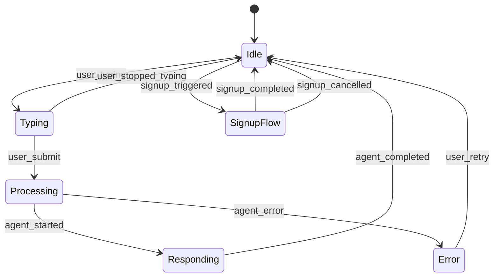

# Widget State Machine Reference

The ChatKit widget operates as a finite state machine.

---

## State Diagram

## State Definitions

| State | Description | UI Indicators | Allowed Transitions |
|-------|-------------|---------------|---------------------|
| **Idle** | Widget ready for input | Input enabled, cursor active | Typing, SignupFlow |
| **Typing** | User actively typing | Character count, "Typing..." | Idle, Processing |
| **Processing** | Agent orchestration in progress | Loading spinner, "Thinking..." | Responding, Error |
| **Responding** | Agent streaming response | Typing animation, partial text | Idle |
| **Error** | Recoverable or fatal error | Error icon, retry button | Idle |
| **SignupFlow** | Authentication workflow active | Signup modal overlay | Idle |

## UI State Details

### Minimized Widget
- Floating action button (FAB) in bottom-right corner
- Badge count for unread messages
- Click to expand full widget

### Expanded Widget
- Header: Title, mode toggle, close button
- Body: Conversation history (scrollable)
- Input: Text area, send button, voice button (future)
- Footer: Citations, privacy link, powered-by attribution

## Error Recovery States

| Error Type | Recovery Action | Fallback |
|------------|----------------|----------|
| Network timeout | Retry with backoff | Show cached/FAQ response |
| Rate limited | Wait timer display | Disable input until reset |
| Auth expired | Silent token refresh | Prompt re-login |
| Guardrails violation | Show scope message | Suggest related topics |
| Fatal error | Contact support link | Hide widget gracefully |
